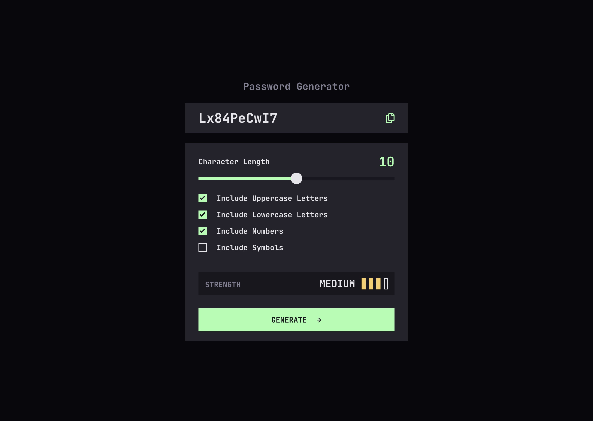

# Frontend Mentor - Password generator app solution

This is a solution to the [Password generator app challenge on Frontend Mentor](https://www.frontendmentor.io/challenges/password-generator-app-Mr8CLycqjh). Frontend Mentor challenges help you improve your coding skills by building realistic projects. 

## Table of contents

- [Overview](#overview)
  - [The challenge](#the-challenge)
  - [Screenshot](#screenshot)
  - [Links](#links)
- [My process](#my-process)
  - [Built with](#built-with)
  - [What I learned](#what-i-learned)
  - [Useful resources](#useful-resources)
- [Author](#author)

## Overview

### The challenge

Users should be able to:

- Generate a password based on the selected inclusion options
- Copy the generated password to the computer’s clipboard
- See a strength rating for their generated password
- View the optimal layout for the interface depending on their device’s screen size
- See hover and focus states for all interactive elements on the page

### Screenshot

### Links

- Solution URL: [https://github.com/webdevbynight/password-generator-app](https://github.com/webdevbynight/password-generator-app)
- Live Site URL: [https://webdevbynight.github.io/password-generator-app/](https://webdevbynight.github.io/password-generator-app/)

## My process

### Built with

- Semantic HTML5 markup
- CSS (via SCSS)
  - custom properties
  - logical properties
  - flexbox
- JavaScript (via TypeScript)
- Mobile-first workflow

### What I learned

I learnt to style `<input type="range">` elements.

### Useful resources

- [Styling Cross-Browser Compatible Range Inputs with CSS](https://css-tricks.com/styling-cross-browser-compatible-range-inputs-css/) - Although this resource is from 2014, this helped me to understand the needs to style `<input type="range">`.
- [::-moz-range-progress](https://developer.mozilla.org/en-US/docs/Web/CSS/Reference/Selectors/::-moz-range-progress) - This resource helped me to style the progress track of `<input type="range">` for Firefox.
- [Styled native range input #40 (updated 2021)](https://codepen.io/thebabydino/pen/azqaex) - This CodePen example helped me to style the progress track of `<input type="range">` for Safari and Blink-based browsers.

## Author

- Website - [Victor Brito](https://victor-brito.dev)
- Frontend Mentor - [@webdevbynight](https://www.frontendmentor.io/profile/webdevbynight)
- Mastodon - [@webdevbynight](https://mastodon.social/webdevbynight)
- Bluesky - [@webdevbynight](https://bsky.app/profile/webdevbynight.bsky.social)
